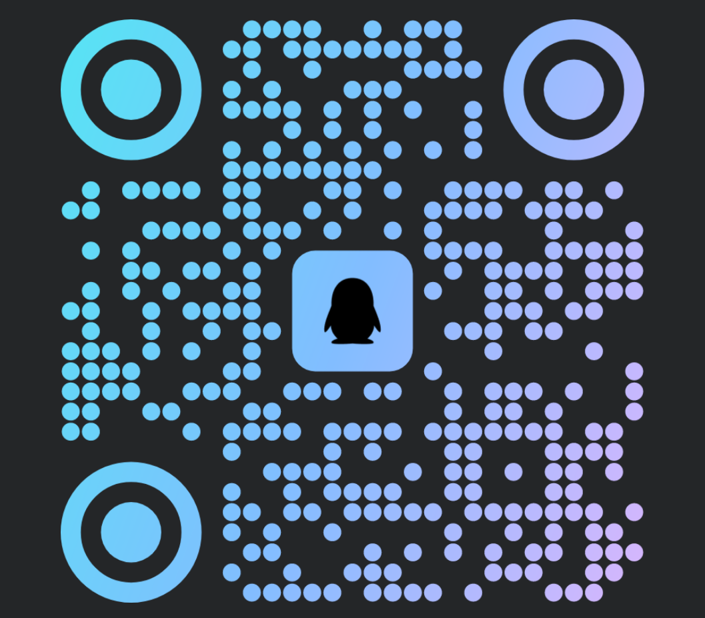

  

  # 欢迎进入 cocosoys 的魔法研究社

  

  

    
    
    
  

  

    
    
    
  

<h2 align="center">
  
  术式徽章墙
  
</h2>

  
  
  
  
  
  
  

 

  

<h2 align="center">
  
  精选魔导记录
  
</h2>

  
  

  

<h2 align="center">
  
  观测记录
  
</h2>

  
  
  

  

<h2 align="center">
  
  GitHub 活动
  
</h2>

  <picture>
    <source media="(prefers-color-scheme: dark)" srcset="https://raw.githubusercontent.com/cocosoys/cocosoys/output/github-contribution-grid-snake-dark.svg" />
    <source media="(prefers-color-scheme: light)" srcset="https://raw.githubusercontent.com/cocosoys/cocosoys/output/github-contribution-grid-snake.svg" />
    
  </picture>
  

  

<h2 id="召唤阵" align="center">
  
  召唤阵
  
</h2>

  
<strong>展开微信与 QQ 召唤阵</strong>

   
  <table>
    <tr>
      <td align="center" width="50%" valign="top">
        <strong>微信</strong>
         
         
        
      </td>
      <td align="center" width="50%" valign="top">
        <strong>QQ</strong>
         
         
        
      </td>
    </tr>
  </table>

<h3 align="center">
  愿每一次灵感降临时，都能留下会发光的作品
</h3>

  模板设计灵感来源：© Zephyr Zhong (https://github.com/zyh3699)

