  

 

  
  
  

 

<table align="center">
  <tr>
    <td align="center" width="33%">
      <strong>PLAYER</strong>
       
      <code>cocosoys</code>
    </td>
    <td align="center" width="33%">
      <strong>CLASS</strong>
       
      <code>anime pixel creator</code>
    </td>
    <td align="center" width="33%">
      <strong>MODE</strong>
       
      <code>forge / plugin / profile craft</code>
    </td>
  </tr>
</table>

 

  
<strong>PLAYER FILE</strong>

   
  <table>
    <tr>
      <td width="28%"><strong>Style Signal</strong></td>
      <td>Anime-inspired, pixel-framed profile surfaces with a creator-first rhythm.</td>
    </tr>
    <tr>
      <td><strong>Build Zone</strong></td>
      <td>Minecraft Forge mods, plugin utilities, lightweight web pages, and presentation tooling.</td>
    </tr>
    <tr>
      <td><strong>Creation Loop</strong></td>
      <td>Idea capture -> playable prototype -> polished profile surface -> publishable artifact.</td>
    </tr>
    <tr>
      <td><strong>Contact Path</strong></td>
      <td>Follow the profile, visit the profile site repo, or open the QR gate below.</td>
    </tr>
  </table>

 

  
<strong>SKILLS WALL</strong>

   
  

    
    
    
    
    
    
    
  

 

  
<strong>STATS TERMINAL</strong>

   
  

    
    
  

 

  
<strong>ACTIVITY SNAKE</strong>

   
  

    <picture>
      <source media="(prefers-color-scheme: dark)" srcset="https://raw.githubusercontent.com/cocosoys/cocosoys/output/github-contribution-grid-snake-dark.svg" />
      <source media="(prefers-color-scheme: light)" srcset="https://raw.githubusercontent.com/cocosoys/cocosoys/output/github-contribution-grid-snake.svg" />
      
    </picture>
  

 

  
<strong>CONTACT GATE</strong>

   
  <table>
    <tr>
      <td align="center" width="50%" valign="top">
        <strong>WeChat</strong>
         
         
        

          
<strong>OPEN WECHAT QR</strong>

           
          
        

      </td>
      <td align="center" width="50%" valign="top">
        <strong>QQ</strong>
         
         
        

          
<strong>OPEN QQ QR</strong>

           
          
        

      </td>
    </tr>
  </table>

